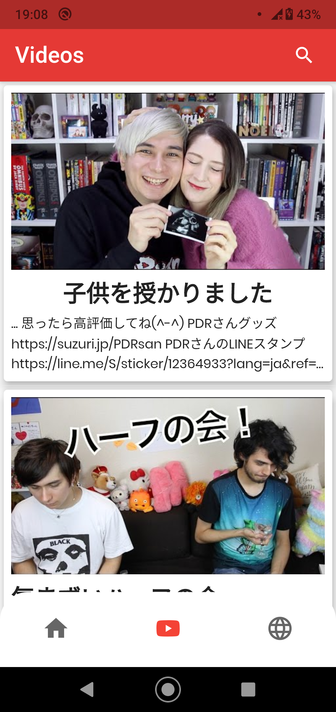

# Limapp - Japanese immersion

A simple Flutter app that aims at making full use of youtube and web content as a learning Japanese learning tool. With basic dictionary functionalities, as well as more sophisticated NLP based functionalities, the app wants to offer a simple tool to make your phone your learning ally

 

The app was built using the [Flutter](https://flutter.dev/) cross-platform framework.

The app makes also use of the incredibly useful [Jisho](https://jisho.org/) api for words lookup

 

## ✨ Features

- [x] Look up words in the dictionary
- [x] Search for japanese videos with captions
- [x] Look up words in the captions or study sentences extracted from the captions
- [x] Import a web article to be able to study it and save words/sentences you don't undestard to study them later 
- [x] Starting from a sentence, search for the most similar/dissimilar sentences
- [x] Automatically organize your sentences/documents by category/topic
- [ ] Find most frequent words that use a certain kanji
- [ ] Share words/sentences with AnkiDroid

## 📸 Screenshots

Home
 ---------------------------------

| Videos                             | Articles                              |
| --------------------------------- | --------------------------------- |
|   |   |
|   |   |
|   |   |
|   |   |
|   |  |
|   |  |
